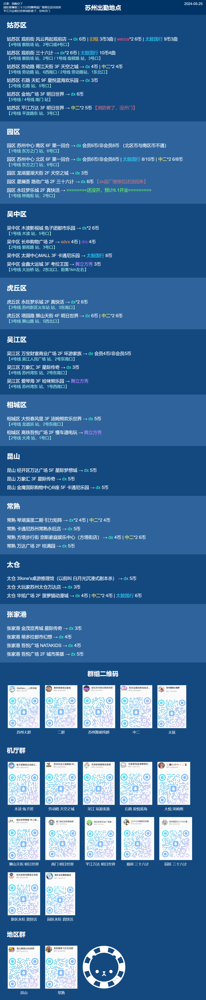

苏州maimai出勤地点

更新日期：2024-05-25

各个机厅的币价、机况、营业时间可能会有变化，本文档的营业时间参考的美团

# 苏州出勤地点 - 按区域分组



# 苏州出勤地点 - 铺货日期倒序

<details> <summary>苏州出勤地点 - 铺货日期倒序</summary>

只记录个大概，机厅、机台、币数有变化，并不准确

```text

园区 永旺梦乐城 真快活 [2024-06-01]

太仓 华旭广场 2F 菠萝猫动漫城 [2024-05-02]

姑苏区 平江万达广场 明日世界 [2024-05-01]


姑苏区 观前街 三十六计 → dx*2 6币→4币→6币 ，太鼓国行 12币 [2024-02-06]

园区 星斓荟·路劲广场 三十六计 → dx 6币 [2024-01-31]

姑苏区 金地广场 明日世界 → dx 6币 [2024-01-23]

园区 苏州中心北区 第一回合 → dx 6/8币，太鼓国行 8/10币，中二*2 6/8币 [2024-01-19]

园区 龙湖星湖天街 天空之城 → dx 3币 [2024-1月初]

【太鼓】吴中区 太湖中心MALL 卡通尼乐园 → 太鼓国行 8币 [2023-12月底]

昆山 金鹰国际购物中心B座5F 卡通尼乐园 → dx 5币 [2023-11-27]

常熟 万达广场2楼 桂满园 → dx 5币 [2023-11-20]

虎丘区 塔园路 狮山天街 4楼 明日世界 → 中二*2 6币 [2023-10月] | dx 6币 [2023-10-28]

【机台已撤走】虎丘区 永旺梦乐城 3楼 莫莉幻想苏州高新永旺梦乐城店 → 太鼓国行 10币 [2023-9月初]

常熟 方塔步行街 奈斯家庭娱乐中心(方塔街店) → dx 4币 | 中二*2 6币［2023-08-05］

虎丘区 永旺梦乐城 真快活 → dx*2 6币［2023-07-14］

常熟 琴湖溪里二期 引力矩阵 dx*2 4币［2023-06-30]，中二*2 4币 [2023-09-30]

姑苏区 劳动路 胥江天街 天空之城 → dx 3币 | 中二🐧*2 4币 ［2023-06-30］

吴江区 万宝财富商业广场 环游家族 → dx 非会员5/会员4币 ［2023-06-16］

昆山 经开区万达广场 星际梦想城 → dx 3币 [2023-04-28]

张家港 金茂览秀城 星际传奇 → dx 3币 [2022年底]

【没有舞萌】吴中区 长申购物广场 4楼 → sdvx 4币 drs 4币

太仓 39one's桌游推理馆（以前叫 白月光沉浸式剧本杀） → dx 5币 [2022-10-20]

吴中区 木渎影视城 兔子团都市乐园 → dx*2 4币 [20220912] | 中二 6币 [2023-04-17]（中二已经寄了）

园区 印象城 星际传奇 → dx 3币 [2022-08-01] 旧机子，机子出厂日期大概在2021-06-18

太仓 大玩家苏州太仓万达店 → dx 3币 [2022-01-12]

张家港 萌多拉都市幻想 → dx 4币 [2021年年底？]

相城区 汤姆熊欢乐世界（大悦春风里）→ dx 5币 [2021-11-10]

张家港 杨舍镇吾悅 NATAKIDS → dx 4币 [时间在卡通尼与大悦汤姆熊之间，2021年9-11月]

常熟 卡通尼苏州常熟永旺店 → dx 5币 [2021年9月？]

姑苏区 石路 天虹 星悦蓝海欢乐园 → dx 3币 [2021-08-21]

园区 苏州中心 南区6楼 第一回合 → dx 会员4币/非会员5币→会员6币/非会员8币 [2021年1月底]

【已闭店】姑苏区 风云再起莱迪店（也叫hgc，韩国城）→ dx 6币 [2020年]

昆山 万象汇 3楼 星际传奇 → dx 4币 [2019年底]

姑苏区 风云再起观前店 → dx 6币 [2019年底] | 旧框 3币3曲 | wacca 6币 | 太鼓 | 舞立方
```

</details>

# 姑苏区

## 姑苏区-观前街-风云再起观前店

地址: 姑苏区施相公弄24-36号粤海广场1号楼2层

【4号线 察院场 站，2号口/4号口】或者
【1号线 乐桥 站，7号口】

苏州第一台dx（2019年底），当时8币一局持续了相当长的一段时间，持续到苏州中心有dx的第二天（2021年1月底），然后降为6币

机厅配置：1台 dx - 6币，1台旧框 jinale - 3币，2台 wacca - 6币，1台太鼓国行 - 9币，1台舞立方 - 3币

买币领币优惠：<br />
学生卡，每天有领币和买币优惠<br />
畅玩令，每个月月底买币的时候可以拿一张下个月的畅玩令，畅玩令上每天有写好的指定福利，一个月有那么几天是可以领币的<br />
风云楼下发的小卡片，每周领币以及买币优惠，需要身份证

生日买币：生日当月优惠买币，生日买币的币价是最低的，还送小礼品，这个几乎是必买

营业时间：10:00 - 24:00

## 姑苏区-石路-天虹-星悦蓝海欢乐园

地址: 姑苏区石路天虹商场9楼【2号线 石路 站，5号口步行190米】

机厅配置：1台dx - 3币

机台添加日期 ：[2021-08-21]

营业时间：10:00 - 24:00

## 姑苏区-劳动路-胥江天街-天空之城

地址: 姑苏区劳动路777号首开龙湖苏州胥江天街南馆3F层A-3F-31/32a

【5号线 劳动路 站，6西南口 / 2号线 劳动路 站，1东北口】

机厅配置：1台dx - 4币，2台中二 - 4币

机厅开业日期： [2023-06-30]

营业时间：10:00 - 22:00

## 姑苏区-金地广场-明日世界

地址：姑苏区金地广场3楼明日世界 【5号线/4号线 南门 站，7西南口】

机厅配置: 1台dx - 6币

机台添加日期：[2024-01-23]

营业时间：09:00 - 21:30

## 姑苏区-观前街-三十六计

地址：观前街46号、48号（观前1号购物中心的对面）

【4号线 察院场 站，2号口 / 1号线 临顿路 站，3号口】

机厅配置：dx*2 6币，太鼓国行 10币

    dx 一台是新的，一台是从扬州搬来的旧机子

机厅开业时间：[2024-02-06]

营业时间：09:00 - 23:00

## 姑苏区-平江万达广场-明日世界

地址：姑苏区 平江万达广场3楼 明日世界

【2号线 平泷路东 站，3号口】

机厅开业时间：2024-05-01

机厅配置：中二*2 5币 [2024-05-01]

营业时间：10:00 - 22:00

# 园区

## 园区-苏州中心-南区6楼-第一回合

地址: 苏州中心 南区 6楼

【1号线 东方之门 站，6号口】

机厅配置：1台dx - 会员6币/非会员8币

机台添加日期：2021年1月底

只能刷卡，买币套餐可以看 神采飞扬 微信小程序，南区店和北区店的币不通用

营业时间：10:00 - 22:00

## 园区-苏州中心-北区6楼-第一回合

地址: 苏州中心 北区 6楼

【1号线 东方之门 站，6号口】

机厅配置：1台dx - 会员6币/非会员8币，2台中二 - 会员6币/非会员8币，1台太鼓国行 - 会员8币/非会员10币

机厅开业日期 ：[2024-01-19]

营业时间：10:00 - 22:00

## 园区-龙湖星湖天街-天空之城

地址: 龙湖苏州星湖天街A座2F层A-2F-35

机厅配置：1台dx - 3币

机台添加日期：2024年1月初

营业时间：10:00 - 22:00

## 园区-星斓荟-路劲广场-三十六计

地址: 园区 星斓荟·路劲广场2层 三十六计

机厅配置：1台dx - 6币，从扬州搬来的旧机子

添加日期：[2023-01-31]

营业时间：10:00 - 22:00

## 园区-永旺梦乐城-真快活
地址：园区 永旺梦乐城2楼 真快活

【1号线 钟南街 站，2号口】

机厅开业日期 ：还没开

# 吴中区

## 吴中区-木渎影视城-兔子团都市乐园

地址: 吴中区木渎镇金山南路288号木渎影视城1号楼

【1号线 木渎 站，5号口】

机厅配置：2台dx - 6币

机台添加日期：[2022-09-12]

营业时间：10:00 - 22:00

## 吴中区-长申购物广场2楼

地址: 吴中区郭新东路95号长申购物广场2层

【2号线 郭苑路 站，3号口】

机厅配置：1台sdvx - 4币，1台drs - 4币

只能刷卡

营业时间：10:00 - 21:00

## 吴中区-太湖中心MALL-卡通尼乐园（太湖中心分店）

地址： 吴中区香山路与伍相路交叉口太湖中心MALL

机厅配置：1台太鼓国行 - 8币

营业时间：10:00 - 22:00

## 吴中区-金鑫大运城3F-考拉王国

地址：吴中区金鑫大运城3F考拉王国
【5号线 大治桥 站，2东北口，距离1km左右】

机厅配置：舞立方秀

营业时间：10:00 - 22:00

## 吴中区-丽丰购物中心-动感无限电玩城

地址：吴中区丽丰购物中心2F动感无限电玩城
【4号线/11号线/3号线 宝带路 站，4东南口】

机厅配置：舞立方秀

营业时间：09:30 - 21:00

# 虎丘区

## 虎丘区-永旺梦乐城-真快活

地址: 虎丘区高新区城际路19号永旺梦乐城2F232-233号商铺
【3号线 苏州新区火车站 站，3号口出来步行600米】

机厅开业日期：2023-07-14

机厅配置：2台dx - 6币

营业时间：10:00 - 21:30

## 虎丘区-塔园路-狮山天街4楼-明日世界

地址: 虎丘区塔园路181号龙湖苏州狮山天街L4层

【地铁3号线 狮山路 站，5西北口】

机厅配置：2台中二 6币 [2023-10月]，一台dx 6币 [2023-10-28]

营业时间：10:00 - 22:00

# 吴江区

## 吴江区-万宝财富商业广场-环游家族

地址：万宝财富商业广场2楼 环游家族

【4号线 吴江人民广场 站，2号东南口】

机厅配置：1台dx - 会员4币/非会员5币

营业时间：10:00 - 21:30

## 吴江区-万象汇-星际传奇

地址：吴江区吴江万象汇

机厅配置：1台dx - 3币，是从已经闭店的歌林公园的星际传奇搬过来的

营业时间：10:00 - 22:00

## 吴江区-爱琴海3F-哈咪熊乐园

地址：吴江区爱琴海3F哈咪熊乐园
【4号线 苏州湾东 站，1号西南口】

机厅配置：舞立方秀

营业时间：10:00 - 22:00

# 相城区

## 相城区-大悦春风里-汤姆熊欢乐世界

地址: 相城区元和街道御窑路1999号苏州大悦城L3-20 (以前叫 大悦春风里)

【4号线 龙道浜 站，2号东南口出来】

机厅配置：1台dx - 5币

机台添加日期：[2021-11-10]

营业时间：10:00 - 22:00

## 相城区-高铁吾悦广场2F-慢车道电玩

地址: 相城区高铁吾悦广场2F慢车道电玩
【2号线 大湾 站，1号口】

机厅配置：舞立方秀

营业时间：10:00 - 22:00

# 昆山

## 昆山-万象汇-星际传奇

地址: 昆山市前进西路1266号昆山万象汇F3层

机厅开业日期：2019年底

机厅配置: 1台dx - 5币

营业时间：

    周一至周四、周日 10:00 - 21:30

    周五、周六 10:00 - 22:00

## 昆山-经开区万达广场-星际梦想城

地址: 昆山市经开区万达广场五楼

机厅配置：1台dx - 5币

机台添加日期：[2023-04-28]

营业时间：10:00 - 22:00

## 昆山-金鹰-卡通尼乐园

地址: 江苏省昆山市珠江中路199号金鹰国际购物中心B座5F卡通尼乐园

机厅配置：1台dx - 5币

只能刷卡

机台添加日期：[2023-11-27]

营业时间：10:00 - 22:00

# 常熟

## 常熟-卡通尼苏州常熟永旺店

地址: 常熟市东南大道168号永旺梦乐城

机厅配置：1台dx - 5币

机台添加日期：大概在2021年9月

营业时间：10:00 - 22:00

## 常熟-琴湖溪里二期-引力矩阵

地址: 常熟市琴湖溪里二期商业中心

机厅配置：2台dx - 4币，2台中二 - 4币

机厅开业日期：[2023-06-30]

机台添加日期：dx[2023-06-30]、中二[2023-09-30]

营业时间：10:00 - 24:00

## 常熟-奈斯家庭娱乐中心(方塔街店)

地址：常熟市虞山街道方塔步行街7-2号楼 奈斯家庭娱乐中心(方塔街店)

机厅配置: 1台dx - 4币，2台中二 - 6币

机厅开业日期：[2023-08-05]

营业时间：10:00 - 22:00

## 常熟-万达广场2楼-桂满园

地址：常熟市常福街道珠海路10号万达广场2楼

机厅配置: 1台dx - 5币

机台添加日期：[2023-11-20]

营业时间：10:00 - 22:00

# 太仓

## 太仓-万达广场-大玩家

地址: 太仓市上海东路188号万达广场太仓店2层娱乐楼Z-2F-A

机厅配置：1台dx - 3币

机台添加日期：[2022-01-12]

营业时间：09:30 - 22:00

## 太仓-39one's桌游推理馆

地址：太仓市东亭北路6号华东汽贸3层

机厅配置：1台dx - 5币

机台添加日期：[2022-10-20]

以前叫 白月光沉浸式剧本杀，后来改名为 39one's桌游推理馆

营业时间：13:00 - 24:00

## 太仓-华旭广场2F-菠萝猫动漫城

地址：太仓市人民南路华旭广场2F菠萝猫动漫城

机厅配置：1台dx - 4币，2台中二 - 4币，1台太鼓国行 - 6币

机台添加日期：[2024-05-02]

营业时间：10:00 - 22:00

# 张家港

## 张家港-吾悅广场-2F-城市英雄

地址: 张家港市吾悦广场2F城市英雄

机厅配置：1台dx - 5币

机台添加日期：[2024-5月中旬]

营业时间：9:30 - 21:30

## 张家港-杨舍镇吾悅广场-NATAKIDS

地址: 张家港市金港大道与南二环路交叉口西240米
金港大道路333号吾悅广场商铺311室

它以前叫极客森，后来改名为NATAKIDS

机厅配置：1台dx - 4币

机台添加日期：大概在 2021年9-11月（时间在卡通尼与大悦汤姆熊之间）

营业时间：10:00 - 21:30

## 张家港-萌多拉都市幻想

地址: 张家港市金港街道中港南路99号中骏世界城二楼M251
张家港市中骏·世界城购物中心2层（东南角1号门进入后扶梯上二楼就是）

机厅配置：1台dx - 4币

机台添加日期：大概在2021年年底

营业时间：10:00 - 22:00

## 张家港-金茂览秀城-星际传奇

地址：张家港金茂览秀城三楼

机厅配置：1台dx - 3币

添加日期：在白月光沉浸式剧本杀之后，大概在2022年底

营业时间：

    周一至周五 10:00 - 22:00

    周六、周日 10:00 - 22:30

# 已经倒闭关门 / 机台被撤走的机厅

## 相城区-美京广场-风云再起

已经倒闭，曾经观前风云的 maimai 搬过去玩了一段时间

## 园区-龙湖星湖天街-散步的蜗牛

机厅开业日期 2023-04-28，两台舞萌dx 2023年7月初已经撤走

## 吴中区-歌林公园-星际传奇

已经闭店，dx搬到了吴江万象汇星际传奇

## 虎丘区-永旺梦乐城3楼-莫莉幻想

太鼓已经撤走

## 姑苏区-观前街-风云再起莱迪店

地址: 姑苏区观前街碧凤坊41号莱迪购物F3层

这个商城的名字最开始是 韩国购物城 ，后来改名为 莱迪购物 ，所以它有时候会被叫做 韩国城（hgc）<br />
它跟观前店离的很近，买币领币优惠也是类似，具体参考观前店

机厅配置：1台dx - 6币

机厅开业日期：大概在2020年

营业时间：10:00 - 22:30

2024-04-15 闭店

## 园区-印象城-星际传奇

地址：园区 现代大道1699号印象城3楼

机厅配置：1台dx - 3币，从别的地方搬来的旧机子

机台添加日期：[2022-08-01]

营业时间：10:00 - 21:00

2024-04-28 dx已撤走，搬去上海了，据说搬到了上海真如星际传奇